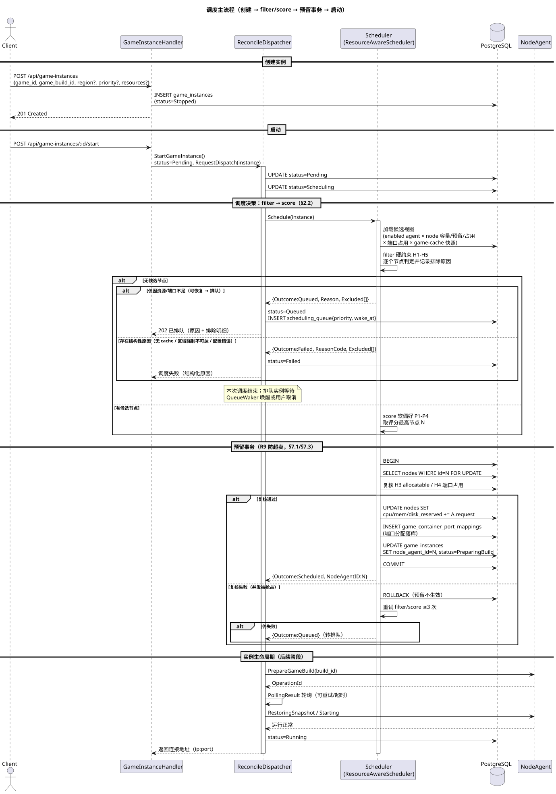
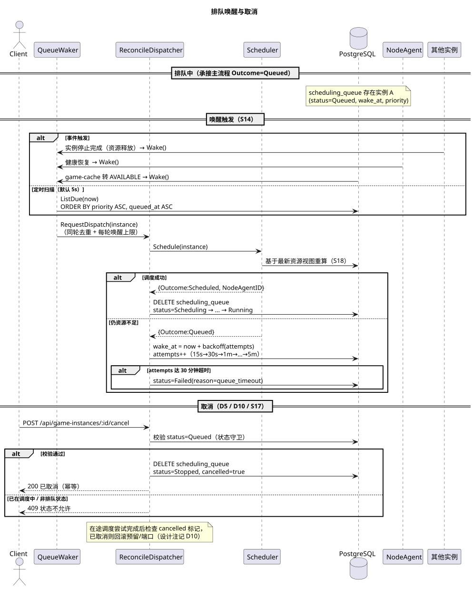

# 调度器设计文档（Scheduler Design）

- 状态：设计 v1（草稿）
- 前置输入：`docs/scheduler-requirements.md`（需求 R1-R9、决策 D1-D10、补充需求 S1-S41、NFR N1-N5）
- 范围：controller-go `internal/biz` 调度器改造 + 数据模型 + API，涉及 node_agent 侧少量改动（资源上报）
- 目标：把需求落地为可实现的模块划分、流程、表结构、接口与集成点

---

## 1. 设计总览

### 1.1 模块划分（controller-go 内）

```text
internal/biz/
  scheduler.go              # Scheduler 接口（改造）+ ScheduleResult 类型
  scheduler_impl.go         # ResourceAwareScheduler（替换 SimpleScheduler）
  candidate.go              # NodeCandidate 组装（节点候选视图）
  constraint.go             # 硬约束 filter（H1-H5）
  scoring.go                # 软偏好评分（P1-P4）
  reservation.go            # 资源预留事务（预留/释放/超时）
  queue.go                  # 排队管理器（持久化队列 + 优先级）
  queue_waker.go            # 排队唤醒器（事件 + 定时扫描 + 退避）
  stale_reservation_reaper.go # 中间态卡死哨兵（预留超时释放, 7.4）
  node_capacity.go          # 节点容量视图（static + dynamic + reserved + headroom）
  node_cache_view.go        # game-cache 视图（进程内快照，周期刷新）
  resource_sampler.go       # node_agent 资源上报接收与采样落库
  pressure_monitor.go       # 节点压力状态机（实际占用持续超阈 → Warning/Critical）
```

依赖关系（保持单向）：

```text
ReconcileDispatcher ──> Scheduler(接口)
                          ├─> candidate.go ──> node_capacity.go / node_cache_view.go
                          ├─> constraint.go / scoring.go
                          └─> reservation.go ──> repository
QueueWaker ──> Scheduler ──> queue.go
HealthMonitor ──> Scheduler(SetAlive/SetHealth) + ResourceSampler(落库)
GameCacheManager ──> NodeCacheView（共享 cache 状态来源）
```

### 1.2 运行时组件

| 组件 | 启动方式 | 职责 |
|---|---|---|
| ResourceAwareScheduler | 常驻（被 dispatcher 调用） | filter → score → 预留 → 绑定 |
| QueueWaker | 后台 goroutine（同 GameCacheManager.Start 模式） | 定时扫描 + 事件唤醒排队实例 |
| StaleReservationReaper | 后台 goroutine | 中间态卡死哨兵：超时释放预留（7.4） |
| NodeCacheView | 后台 goroutine 周期刷新 | 维护 node×(game,branch) 缓存状态快照 |
| ResourceSampler | 接收 node_agent 上报（新 gRPC/HTTP 或复用心跳） | 写 nodes 动态列 + node_resource_samples |
| PressureMonitor | 后台 goroutine | 压力状态机：实际占用持续超阈 → Warning/Critical（3.3），联动 scheduler 与回收 |
| NodeAgentHealthMonitor（已有） | 已有 | 扩健康状态，联动 scheduler + waker |

---

## 2. 核心调度流程

### 2.1 状态机（新增 queued）

```text
Create ──> Stopped ──start──> Pending ──> Scheduling
Scheduling ──成功──> PreparingBuild ──> RestoringSnapshot ──> Starting ──> Running
Scheduling ──结构性失败──> Failed（带原因，可 retry 回 Pending）
Scheduling ──资源不足/端口不足──> Queued（写入 scheduling_queue）
Queued ──唤醒重试成功──> Scheduling ──> ... ──> Running
Queued ──取消──> Stopped（移除出队）
Queued ──排队超时──> Failed（原因=queue_timeout）
Queued ──删除实例──> 出队并删除
```

现有 `dispatchableStatuses` 加入 `StatusQueued`（waker 需要）；`RequestDispatch` 对 queued 不直接入内存队列，由 waker 统一唤醒（见 8.3）。

### 2.2 一次调度尝试（scheduler.Schedule 内部）

```text
1. 组装候选视图（candidate.go）
   加载 enabled node_agent × node × 动态占用/预留 × 压力状态 × 健康 × 端口占用 × cache 快照
2. filter（constraint.go）硬约束 H1-H6，逐个节点判定，记录排除原因
3. 无候选 → 分类处置（2.4）
4. score（scoring.go）软偏好 P1-P4 → 排序取最优
5. 预留事务（reservation.go）：
   a. BEGIN
   b. SELECT nodes ... FOR UPDATE（锁目标节点行）
   c. 复核 H3/H4（防止并发期间资源变化）
   d. 扣减 reserved 列 + 写端口映射
   e. 写 game_instances.node_agent_id + status=PreparingBuild
   f. COMMIT
6. 预留失败（行锁竞争/复核不过）→ 重试整个 filter/score（最多 3 次）→ 仍失败转 2.4 分类
```

**关键点**：第 5 步是 R9（不因资源不足失败）的落地手段——容量判定一律基于"预留后视图"，且预留与绑定同事务（N4）。

### 2.3 失败原因分类（决策出口）

`ScheduleResult.Outcome ∈ {Scheduled, Queued, Failed}`。

分类算法：遍历所有节点的排除原因，聚合为两组：

```text
可恢复原因集合 R = {cpu不足, 内存不足, 磁盘不足, 端口不足/不可连续分配, 节点压力(Warning/Critical)}
结构性原因集合 F = {无注册agent, 无game-cache, 区域强制不可达, 配置错误, 资源需求超单节点容量}
```

- 若所有节点**仅**因 R 被排除 → `Queued`（5.1 节）；
- 若存在 F 原因且非资源性原因占主导 → `Failed`，`ReasonCode` 取首个结构性原因；
- 边界：节点全部下线/不健康/Disabled → 视为可恢复 → `Queued`（带超时，最终以 queue_timeout 失败）。
- 排队/失败判定基于**本次调度尝试的最新视图**（S18），不做跨时间的快照缓存。

### 2.4 时序

#### 2.4.1 创建并启动（一次成功）

```text
Client  POST /api/game-instances {game_id, game_build_id, region?, priority?, resources?}
  -> CreateGameInstance: 写入 Stopped（region/priority/resources 落库）
Client  POST /api/game-instances/:id/start
  -> StartGameInstance: status=Pending, RequestDispatch
  -> Dispatcher.Dispatch(Pending): status=Scheduling, RequestDispatch
  -> Dispatcher.Dispatch(Scheduling): scheduler.Schedule(ctx, instance)
       -> candidate/filter/score -> 预留事务 -> 返回 {Outcome:Scheduled, NodeAgentID:N}
  -> Dispatcher: assignPorts 已在预留事务内完成（见 8.1），status=PreparingBuild
  -> PrepareGameBuild -> PollingResult -> RestoringSnapshot -> Starting -> Running
```

#### 2.4.2 排队与唤醒

```text
  -> Dispatch(Scheduling): Schedule 返回 {Outcome:Queued, Reason:"cpu 不足", Excluded:[...]}
  -> status=Queued；scheduling_queue 写入 {instance_id, priority, reason, wake_at=now+15s, attempts=1}
  ... 期间节点资源释放（另一实例 stopped）
  -> QueueWaker.Wake()（事件）: 扫描队列, 重算
  -> 对 A 重新 Schedule: 成功 -> 清队列行 -> status=Scheduling（回到 2.4.1 后续）
      仍不足 -> wake_at = now + backoff(attempts)，attempts++
      attempts 达超时 -> status=Failed(reason=queue_timeout)
```

#### 2.4.3 取消

```text
Client  POST /api/game-instances/:id/cancel
  -> 仅 status=Queued 允许（状态守卫）
  -> 置 cancelled 标记 + 删除 scheduling_queue 行 + status=Stopped
删除联动: DELETE /api/game-instances/:id 时若 Queued -> 同时出队
竞态: 在途调度尝试完成后检查 cancelled 标记，已取消则回滚预留/端口（设计注记 D10）
```

### 2.5 时序图（PlantUML）

源文件与渲染图位于 `docs/uml/`：

| 图 | 覆盖流程 |
|---|---|
| 调度主流程 | 创建 → filter/score → 预留事务（含排队/失败分支）→ 启动（`scheduler-schedule.puml`） |
| 排队唤醒与取消 | 唤醒触发（事件/定时）→ 重试/超时 → 取消（`scheduler-queue-cancel.puml`） |





---

## 3. 资源模型

### 3.1 实例资源请求（request）

- 来源优先级：创建 API 显式传入 > `game_container_config` 默认值（D8 扩展）> 系统默认（cpu=1 核、mem=1Gi、disk=10Gi、带宽=50Mbps）。
- 字段（`game_instances` 新增 JSON 列 `resource_request`，或展开为列，见 5.3）：

```json
{
  "cpu_milli": 2000,
  "memory_bytes": 8589934592,
  "disk_bytes": 21474836480,
  "bandwidth_rx_mbps": 100,
  "bandwidth_tx_mbps": 100
}
```

- request 用于容量判定（S1）；limit 不属于调度输入。

**request 声明规范（单核应用）**：

- `cpu_milli` 语义 = **CPU 时间片需求**（与 K8s `requests.cpu` 对齐）：`1000m` = 独占 1 核的全部时间片。单核（单线程）应用必须声明 `cpu_milli ≥ 1000` 且为整核（`% 1000 == 0`）——milli 是"时间片池"模型，4 核节点跑 4 个 1000m 单核实例时调度器公平轮转，每个实例拿满自己的核，模型天然兼容单核。
- **风险场景**：单核应用被错误声明为 500m → 调度器误判"半核够用"，容器 quota 限半速 → 游戏卡顿。调度器无法从 request 推断单核性，必须显式声明。
- **补强**：`game_container_config` 增加 `single_threaded BOOLEAN`（000017 迁移）；`single_threaded=true` 时创建/调度校验整核，违规 → `FailCodeConfigError`；该标志同时启用评分项"单核主频偏好"（6.2 可选扩展）。

### 3.2 节点容量视图（H3 判定基础）

**三层资源视图（R2 完整落地：当前占用 + 过去占用 + 实例需求）**：

```text
① 预留视图（硬约束主依据）    allocatable = capacity − reserved − headroom
② 压力状态机（硬约束补充）    实际占用持续超阈 → Warning/Critical → 停止新调度（3.3）
③ 历史视图（评分 + 压力辅助）  窗口均值/P95/波动 → history_score 与压力判定（3.4）
```

- ① 负责**承诺一致性**：调度间的相互超卖由它防（稳定、不抖动，CPU 瞬时波动不进入——避免上报瞬间高/低导致误判）；
- ② 负责**实际负载兜底**：覆盖非平台负载、实例实际超用 request、容量配置误差（用"持续观测"防抖，不用瞬时值）；
- ③ 负责**趋势与风险**：历史持续高压的节点即使此刻预留有空，也降分/排除（本层同时为 ② 提供"持续观测"窗口）。

**单位规范（内部统一，代码层换算）**：

| 资源 | 内部单位 | 来源与换算 |
|---|---|---|
| CPU | milli 核（1 核 = 1000m） | `capacity = core_num × 1000`；**core_frequency 不乘进容量**（异质节点仅作评分参考，避免"2 核高频机 > 4 核低频机"的失真）；单核应用声明 ≥ 1000m 整核（3.1 声明规范） |
| 内存 | bytes | 现有 `memory_size` 列为 **MB**（seed 中 16384 = 16GiB），内部统一换算 `× 1024 × 1024` |
| 磁盘 | bytes | 现有 `storage_size` 列为 MB，同上换算 |

**capacity 语义（关键前提）**：`nodes` 容量字段 = **平台可分配上限**，而非物理总量——系统进程、非平台服务的开销由运维在配置容量时预留扣除（或可选：容量 = 物理量 × 平台利用率系数）。否则 reserved 视图会把系统占用误判为可用，导致实际超卖。

**可用量公式**：

```text
allocatable(cpu)  = cpu_capacity_milli  − cpu_reserved_milli  − cpu_headroom_milli
allocatable(mem)  = memory_bytes_total  − memory_reserved_bytes − memory_headroom_bytes
allocatable(disk) = disk_bytes_total    − disk_reserved_bytes   − disk_headroom_bytes
```

- **reserved**：已调度实例的 request 之和（调度事务扣减、实例停止/删除/失败/卡死释放，见 7.2），实时占用**不参与** allocatable（S4 防双重扣减）。
- **headroom**：`capacity × (1 − utilization_target)`，默认 `utilization_target = 0.8`（S31）。作用：缓冲实例实际占用超 request 的波动、节点其他开销、防止打满。
- 实时占用（cpu_used/memory_used）仅用于评分（P4）与告警，不进 allocatable。

**充足判定（H3）**：cpu / mem / disk **逐维独立**判定，`allocatable ≥ request` 即该维充足；**任一维不满足 → 节点排除**，排除原因附缺口量（`request − allocatable`，F1）。

**原子性与并发**：复核必须在预留事务内（7.1）——`FOR UPDATE` 锁节点行后重算 allocatable，或等价的条件更新 `UPDATE nodes SET reserved = reserved + ? WHERE reserved + ? <= capacity × utilization_target`（影响行数 0 = 失败）。两种方式都保证并发调度不超卖（N4）。

**边界情况**：
- `request > capacity × utilization_target`（单节点容量装不下）→ **结构性失败** `FailCodeConfigError`，不入队（永远不会有节点满足，排队无意义）。
- request 缺失/为 0 → 取 `game_container_config` 默认值（3.1）。
- 节点容量未配置（0 或 NULL）→ 视为容量不足并记录原因，避免把无容量节点当可用。

### 3.3 节点压力状态机（② 实际占用兜底）

状态集合（dev doc 13.4 落地）：

```text
Normal    实际占用（cpu/mem，取较大者）持续 < pressure_warning_pct（默认 85%）
Warning   持续 ≥ 85%（连续 pressure_observe_periods 个采样周期，默认 3）→ 停止新调度
Critical  持续 ≥ pressure_critical_pct（默认 95%）或 Warning 持续超过时长 → 触发回收空闲实例
Offline   心跳失联（health unhealthy）→ 实例走 Uncertain/fencing（S26）
```

判定要点：

- **"持续 N 个采样周期"是防抖核心**：CPU 瞬时尖峰（游戏启动、存档瞬间）不触发状态迁移；压力判定天然使用历史窗口（3.4 的采样数据），回答"CPU 波动是否 hold 住"——波动被观测窗口吸收。
- **对调度的影响**：Warning/Critical → 等同硬约束排除（H6），排除原因"节点压力 Warning/Critical"；恢复 Normal（连续 N 周期低于阈值）→ 重新进入候选。
- **与预留视图的关系**：② 不替代 ①——即使 reserved 还有空，实际负载持续高压也停止新调度（覆盖非平台负载与实例超用）；反之 reserved 不足时 ① 直接排除，无需等压力。
- **回收联动**：Critical → 通知 controller 回收空闲实例（S41 职责边界），回收释放的资源通过事件触发排队唤醒。

### 3.4 资源上报与采样（③ 历史视图数据源）

- node_agent 心跳/上报扩展：`GetHeartbeat` 响应携带 cpu_used_milli、memory_used_bytes、disk_used_bytes、net_rx_bps、net_tx_bps（node_agent `SystemInfoProvider.heartbeat()` 已能提供系统信息，扩字段即可）。
- controller 侧 `ResourceSampler`：心跳成功时写 `nodes` 动态列（usage_reported_at 刷新）+ 追加 `node_resource_samples`（保留窗口如 7 天）。
- 陈旧判定（S5）：`usage_reported_at` 超过 `3 × 上报周期` → 该节点动态数据视为陈旧，评分按保守值（视为高占用），不参与加分；压力判定同样按保守处理（不因数据缺失误判 Normal）。
- 历史窗口（S3）：评分（3.4 的 history_score 与 P2 带宽）用 `node_resource_samples` 窗口内均值/P95；压力状态机的"持续判定"也用同一窗口数据。

### 3.5 带宽（D6，软约束）

- 评分项 P2：`bandwidth_headroom = min(带宽上限 − Σ已预留带宽, 上限 − 当前P95占用)`，双向取小。
- 不参与硬约束；`game_container_config` 扩展带宽默认值（D8）。

---

## 4. 数据模型变更（migrations）

### 4.1 000012_nodes_resource.up.sql

```sql
-- nodes: 动态资源（node_agent 上报） + 预留（调度事务维护）
ALTER TABLE nodes ADD COLUMN IF NOT EXISTS cpu_used_milli          INTEGER  NOT NULL DEFAULT 0;
ALTER TABLE nodes ADD COLUMN IF NOT EXISTS memory_used_bytes       BIGINT   NOT NULL DEFAULT 0;
ALTER TABLE nodes ADD COLUMN IF NOT EXISTS disk_used_bytes         BIGINT   NOT NULL DEFAULT 0;
ALTER TABLE nodes ADD COLUMN IF NOT EXISTS net_rx_bps              BIGINT   NOT NULL DEFAULT 0;
ALTER TABLE nodes ADD COLUMN IF NOT EXISTS net_tx_bps              BIGINT   NOT NULL DEFAULT 0;
ALTER TABLE nodes ADD COLUMN IF NOT EXISTS usage_reported_at       TIMESTAMPTZ;
ALTER TABLE nodes ADD COLUMN IF NOT EXISTS cpu_reserved_milli      INTEGER  NOT NULL DEFAULT 0;
ALTER TABLE nodes ADD COLUMN IF NOT EXISTS memory_reserved_bytes   BIGINT   NOT NULL DEFAULT 0;
ALTER TABLE nodes ADD COLUMN IF NOT EXISTS disk_reserved_bytes     BIGINT   NOT NULL DEFAULT 0;
ALTER TABLE nodes ADD COLUMN IF NOT EXISTS pressure_status         INTEGER  NOT NULL DEFAULT 0; -- 0=Normal 1=Warning 2=Critical（3.3，落库供重启恢复）
```

### 4.2 000013_node_resource_samples.up.sql

```sql
CREATE TABLE IF NOT EXISTS node_resource_samples (
    id               BIGSERIAL PRIMARY KEY,
    node_id          TEXT NOT NULL,
    sampled_at       TIMESTAMPTZ NOT NULL,
    cpu_used_milli   INTEGER NOT NULL,
    memory_used_bytes BIGINT NOT NULL,
    disk_used_bytes  BIGINT NOT NULL,
    net_rx_bps       BIGINT NOT NULL,
    net_tx_bps       BIGINT NOT NULL
);
CREATE INDEX IF NOT EXISTS idx_node_resource_samples_node_time
    ON node_resource_samples (node_id, sampled_at);
```

### 4.3 000014_game_instances_schedule_fields.up.sql

```sql
ALTER TABLE game_instances ADD COLUMN IF NOT EXISTS region           TEXT;
ALTER TABLE game_instances ADD COLUMN IF NOT EXISTS priority         INTEGER NOT NULL DEFAULT 100; -- D7
ALTER TABLE game_instances ADD COLUMN IF NOT EXISTS resource_request JSONB;  -- 见 3.1
ALTER TABLE game_instances ADD COLUMN IF NOT EXISTS queued_reason    TEXT;
ALTER TABLE game_instances ADD COLUMN IF NOT EXISTS queued_at        TIMESTAMPTZ;
ALTER TABLE game_instances ADD COLUMN IF NOT EXISTS cancelled        BOOLEAN NOT NULL DEFAULT FALSE; -- D10
```

### 4.4 000015_scheduling_queue.up.sql

```sql
CREATE TABLE IF NOT EXISTS scheduling_queue (
    instance_id TEXT PRIMARY KEY REFERENCES game_instances(id),
    priority    INTEGER NOT NULL DEFAULT 100,
    reason      TEXT,                       -- 排队原因（可读）
    attempts    INTEGER NOT NULL DEFAULT 0, -- 已重试次数
    wake_at     TIMESTAMPTZ NOT NULL,       -- 下次唤醒时间（退避）
    queued_at   TIMESTAMPTZ NOT NULL,
    timeout_at  TIMESTAMPTZ NOT NULL        -- 排队超时截止（S16/D9）
);
CREATE INDEX IF NOT EXISTS idx_scheduling_queue_wake
    ON scheduling_queue (wake_at, priority);
```

### 4.5 000016_node_agents_health.up.sql

```sql
-- 健康状态：0=unknown(未探测) 1=healthy 2=degraded 3=unhealthy
ALTER TABLE node_agents ADD COLUMN IF NOT EXISTS health_status INTEGER NOT NULL DEFAULT 0;
```

### 4.6 000017_game_container_configs_resources.up.sql（D8）

```sql
ALTER TABLE game_container_configs ADD COLUMN IF NOT EXISTS cpu_request_milli      INTEGER NOT NULL DEFAULT 1000;
ALTER TABLE game_container_configs ADD COLUMN IF NOT EXISTS memory_request_bytes   BIGINT  NOT NULL DEFAULT 1073741824;
ALTER TABLE game_container_configs ADD COLUMN IF NOT EXISTS disk_request_bytes     BIGINT  NOT NULL DEFAULT 10737418240;
ALTER TABLE game_container_configs ADD COLUMN IF NOT EXISTS bandwidth_rx_mbps      INTEGER NOT NULL DEFAULT 50;
ALTER TABLE game_container_configs ADD COLUMN IF NOT EXISTS bandwidth_tx_mbps      INTEGER NOT NULL DEFAULT 50;
ALTER TABLE game_container_configs ADD COLUMN IF NOT EXISTS single_threaded       BOOLEAN NOT NULL DEFAULT FALSE;
```

---

## 5. 接口设计

### 5.1 Scheduler 接口（改造）

```go
type ScheduleOutcome int

const (
	OutcomeScheduled ScheduleOutcome = iota
	OutcomeQueued
	OutcomeFailed
)

type ScheduleFailCode int

const (
	FailCodeNone ScheduleFailCode = iota
	FailCodeNoNodeAgent          // 无注册 agent（结构性）
	FailCodeNoGameCache          // 无节点有该 game_build 缓存（结构性, D2）
	FailCodeRegionUnreachable    // 区域强制不可达（结构性, D3）
	FailCodeConfigError          // 配置错误（结构性）
	FailCodeResourceShortage     // 资源/端口不足（可恢复 → 排队）
	FailCodeQueueTimeout         // 排队超时（最终失败）
	FailCodeStaleReservation     // 中间态卡死，预留超时释放（7.4）
)

type NodeExclusion struct {
	NodeAgentID string
	Reasons     []string // 排除原因明细（资源不足附缺口量）
}

type ScheduleResult struct {
	Outcome    ScheduleOutcome
	NodeAgentID string            // Outcome=Scheduled 时有效
	ReasonCode ScheduleFailCode
	Reason     string             // 可读原因
	Excluded   []NodeExclusion    // 全部候选的排除明细（F1/F2）
	Score      float64
	Scores     map[string]float64 // 选中节点各维度得分
}

type Scheduler interface {
	// Schedule 执行一次完整调度尝试（filter → score → 预留事务）。
	Schedule(ctx context.Context, instance *entity.GameInstance) (*ScheduleResult, error)
	// CancelQueued 取消排队（D5：移除出队，实例保持 stopped）。仅 queued 状态允许。
	CancelQueued(ctx context.Context, instanceID string) error
	// QueueStats 排队统计（调试/指标用）
	QueueStats() map[string]any
}
```

### 5.2 repository 接口扩展

```go
// NodeRepository 增加
UpdateDynamicUsage(ctx, nodeID string, u NodeDynamicUsage) error        // ResourceSampler 写
ListAllWithCapacity(ctx context.Context) ([]*NodeCapacityView, error)   // 调度候选视图批量加载
Reserve(ctx, nodeID string, r ResourceRequest) (bool, error)            // 预留事务内扣减（FOR UPDATE 复核）
Release(ctx, nodeID string, r ResourceRequest) error                    // 失败回滚/实例停止释放

// GameInstanceRepository 增加
UpdateScheduleFields(ctx, instance) error // region/priority/queued_* 落库

// 新增 SchedulingQueueRepository
type SchedulingQueueRepository interface {
	Enqueue(ctx, q *entity.SchedulingQueue) error
	Dequeue(ctx, instanceID string) error            // 唤醒成功/取消/删除
	Get(ctx, instanceID string) (*entity.SchedulingQueue, error)
	UpdateWake(ctx, instanceID string, wakeAt time.Time, attempts int) error
	ListDue(ctx context.Context, now time.Time) ([]*entity.SchedulingQueue, error) // wake_at <= now 按 priority 排序
	ListAll(ctx context.Context) ([]*entity.SchedulingQueue, error)
	Count(ctx context.Context) (int64, error)
}
```

### 5.3 HTTP API

```text
POST   /api/game-instances                     # 扩展请求体
POST   /api/game-instances/:id/start           # 已有
POST   /api/game-instances/:id/cancel          # 新增：取消排队（queued → stopped）
POST   /api/game-instances/:id/retry           # 已有：failed → pending（排队超时后重试路径）
GET    /api/game-instances/:id                 # 响应含 queued_reason/queue 位置
GET    /api/debug/scheduler                    # 已有 debug 扩展：队列长度、候选视图、排除明细
DELETE /api/game-instances/:id                 # 已有：删除时联动出队（S38）
```

创建请求体扩展：

```json
{
  "game_id": "dst",
  "game_build_id": "build-676042",
  "region": "sg",
  "priority": 100,
  "resources": { "cpu_milli": 2000, "memory_bytes": 8589934592 }
}
```

---

## 6. 硬约束与评分实现

### 6.1 硬约束判定（constraint.go，数据来源）

| 约束 | 判定 | 数据来源 |
|---|---|---|
| H1 enabled | 候选查询范围限定 `status=Enabled` | node_agents 表 |
| H2 健康 | `health_status ∈ {healthy, degraded}`；`last_heartbeat_at` 在陈旧窗口内；**unknown（未探测）排除** | node_agents 表 + HealthMonitor 更新 |
| H3 资源 | 3.2 allocatable ≥ 3.1 request（cpu/mem/disk），逐维独立判定 | nodes 表 + 预留事务 |
| H4 端口 | 按 `game_container_config.PortExcerpt` 预检：对每个容器端口（含 TCP/UDP 合并、注入模式连续块）在 node 已占用集合中查空位（复用 `GameContainerPortMapper.allocateHostPort/allocateContiguousHostPorts` 的纯函数逻辑，只查不写） | game_container_port_mappings 表 |
| H5 game-cache | 该 (game, branch, build) 在 node 上状态 = AVAILABLE | NodeCacheView 快照 |
| H6 节点非压力 | 压力状态 ∈ {Normal}（Warning/Critical 排除，3.3）；实际占用持续超阈 = 排除原因"节点压力" | 压力状态机（3.3） |

H5 注意（S10/D2）：`DOWNLOADING` 不算命中；候选节点无缓存 → 排除并记 `FailCodeNoGameCache` 相关排除原因；若所有节点均因 H5 排除 → 结构性失败。

### 6.2 评分（scoring.go）

**评分在决策中的位置**：评分只在**通过全部硬约束（H1-H6）的候选集内**排序选最优——评分永远不能"救活"被 filter 排除的节点（如资源不足的节点分再高也无效），只决定"选哪个"，不决定"能不能调度"。

**公式**：

```text
score(N) = w_region   × region_score(N)      ∈ {1, 0}
         + w_bandwidth × bandwidth_score(N)   ∈ [0, 1]
         + w_locality  × locality_score(N)    ∈ {1, 0}
         + w_history   × history_score(N)     ∈ [0, 1]
         + w_balance   × balance_score(N)     ∈ [0, 1]
         + w_degraded  × degraded_penalty(N)  ∈ {0, −1}
```

| 项 | 权重(默认) | 计算 | 说明 |
|---|---|---|---|
| region_score | 1.0 | 实例 region R 与节点 location 匹配 = 1，否则 = 0 | R 为空（任意区域，S40）→ 该项恒 0，不参与决策；D3 默认允许跨区（不匹配只是不加分），如需"惩罚跨区"可配置 `region_penalty`（见下） |
| bandwidth_score | 0.8 | `min(bandwidth_rx_headroom, bandwidth_tx_headroom) / 带宽上限` | headroom = 上限 − max(Σ已预留带宽, 当前 P95 实际占用)，双向取小；归一化到 [0,1]（D6 软约束） |
| locality_score | 0.5 | 实例上次运行的 node_agent 命中 = 1，否则 = 0 | 命中说明本地数据/快照可能在，恢复成本低（数据本地性）；MVP 用二元，后续可扩展为数据完整度连续值 |
| history_score | 0.6 | `1 − min(1, window_avg_util / 100%)`，再乘稳定性修正 | **③ 历史视图（3.4）**：窗口（默认 15 分钟，可配 5/15/60）内 cpu/mem 平均利用率的较大者；波动大（P95 − 均值 差距大）再降权；历史持续高压 → 低分，把趋势风险纳入选点 |
| balance_score | 0.7 | `1 − utilization(N)` | utilization = `max(reserved, used) / capacity`——**取 max 而非相加**：已运行实例的 request 已在 reserved 中，used 反映其实际占用，两者相加会双重计算；max 表达"节点已承诺与已实际负载中的较大者"（详见 7.3 预留视图） |
| degraded_penalty | 2.0 | 健康状态 degraded = −1，否则 = 0 | 负向惩罚项：degraded 节点虽可调度（H2 允许），但被显著压低排名 |

**历史窗口与压力状态的关系**：`history_score` 是连续软信号（选点时权衡），压力状态机（3.3）是离散硬信号（超阈即排除）——同一份 `node_resource_samples` 数据，两处使用：趋势评分用均值/P95，压力判定用"持续超阈计数"。

**可选扩展：单核主频偏好（w_frequency，默认 0）**：对 `single_threaded` 实例，评分增加 `core_frequency` 归一化项（`(freq − 最低)/ (最高 − 最低)`）——单核应用性能取决于单核主频，异质节点上倾向高主频节点；多核/时间片弹性实例不受影响（该项对它们恒 0）。

**权重语义**：权重表达各维度的重要性；所有项已统一到可比量纲（0/1 或 [0,1]），加权和即可。若需强化区域偏好（"惩罚"跨区），二选一：① 调大 `w_region`（简单，跨区少拿分）；② 配置独立 `region_penalty` 项（跨区额外扣固定分）。

**确定性（S7/N1）**：候选按 node_agent_id 稳定排序后再评分，同分取序号小者 → 同输入同输出，可单测、可复现。

**算例**（实例 region=sg、上次运行在 N2、带宽 request 双向 100Mbps；权重取默认）：

| 节点 | region | 带宽余量 | locality | 利用率 | 健康 | 得分 |
|---|---|---|---|---|---|---|
| N1 (sg) | 1 | 0.5 | 0 | 0.6 | healthy | 1.0×1 + 0.8×0.5 + 0.5×0 + 0.7×0.4 = **1.68** |
| N2 (us) | 0 | 0.8 | 1 | 0.2 | healthy | 0 + 0.64 + 0.5 + 0.56 = **1.70** |
| N3 (sg) | 1 | 0.3 | 0 | 0.1 | degraded | 1.0 + 0.24 + 0 + 0.63 − 2.0 = **−0.13** |

结果：选 **N2**——区域不匹配（D3 偏好，不加分但不排除），但带宽余量大 + 数据本地性 + 低负载综合胜出；N3 因 degraded 被惩罚垫底。该例同时演示"区域是偏好不是约束"：区域不匹配的节点依然可能被选中。

---

## 7. 预留与端口事务（reservation.go）

### 7.1 预留获取（与绑定同事务）

```text
BEGIN
  SELECT * FROM nodes WHERE id = ? FOR UPDATE            -- 锁目标节点
  复核 allocatable（H3）与端口占用（H4）                    -- 并发窗口内可能变化
  UPDATE nodes SET cpu_reserved_milli = cpu_reserved_milli + ?, ... WHERE id = ?
  INSERT game_container_port_mappings ...                -- 复用 MapPort 逻辑，事务内写入
  UPDATE game_instances SET node_agent_id = ?, status = ? WHERE id = ?   -- 绑定 + 进入 PreparingBuild
COMMIT
```

### 7.2 预留生命周期与释放挂点（防超卖/防泄漏）

**核心原则（S4/S8）**：容量判定只认"预留视图"，**绝不用实时占用视图**——`allocatable = 容量 − Σ已预留request − headroom`。实时占用仅用于评分（P4）与告警。这样即使实例尚未在节点上真正启动（preparing_build 阶段实际占用为 0），预留也已生效，后续调度不会误判。

预留的扣减发生在调度事务内（7.1），释放必须挂在实例**所有"不再运行"的出口**，统一走 `ReleaseReservation`（扣回 reserved + 删端口映射）：

| 出口事件 | 动作 |
|---|---|
| 实例停止完成（Stopping→Stopped） | 释放预留 + 端口 |
| 实例删除（DeleteGameInstance） | 释放预留 + 端口（含排队中实例无预留的情况） |
| 调度尝试后续阶段失败（FailedInstance） | 释放预留 + 端口 |
| 排队超时回滚（queue_timeout） | 释放预留 + 端口 |
| 中间态卡死超时（7.4 哨兵） | 释放预留 + 端口，实例转 Failed |
| 节点失联期间（Uncertain / fencing） | **预留保持**（实例可能仍在运行，保守正确），恢复后按 fencing 结果处置 |

### 7.3 超卖防护算例

**连续调度场景（A/B/C 依次调度到 N）**：

```text
节点 N 容量: cpu 8000m, mem 16Gi；headroom = 20%（utilization_target=0.8）
A: request 2000m/4Gi   → 调度时 reserved=2000m/4Gi（此时 A 尚未启动，实际占用 0）
B: request 2000m/4Gi   → allocatable 已含 A 的预留，扣减后 reserved=4000m/8Gi
C: request 2000m/4Gi   → allocatable 已含 A+B 的预留，扣减后 reserved=6000m/12Gi
D: request 3000m/6Gi   → allocatable = 8000−6000−1600=400m < 3000m → 资源不足 → 排队
```

C 不会误判，因为容量计算基于 reserved（A+B 的 request 已扣），而非 AB 的实际占用（此时为 0）。

**并发调度场景（A/B/C 同时触发）**：

```text
三个调度请求并发读候选视图时都可能看到 reserved=0；
但预留事务串行化（SELECT nodes FOR UPDATE）：
  - 第一个提交者（如 A）扣减成功；
  - B、C 在事务内复核 H3/H4 时发现 allocatable 不足 → 复核失败 → 重试 filter/score（上限 3 次）或转排队。
无事务的"检查-扣减"两步会被并发击穿，因此预留必须与绑定同事务（N4）。
```

### 7.4 中间态卡死哨兵（StaleReservationReaper）

**问题**：实例调度成功后卡死在中间态（preparing_build / restoring_snapshot / starting），如 node_agent 失联、build 准备挂起。现有 `PollingResult` 轮询超时只覆盖部分路径，若无兜底，预留永久占用 → 节点容量被白白扣住（安全方向正确，但造成容量浪费与排队堆积）。

**设计**：新增轻量组件 `StaleReservationReaper`（与 QueueWaker 同级后台 goroutine）：

```text
周期（默认 60s）扫描 game_instances：
  status ∈ {PreparingBuild, RestoringSnapshot, Starting}
  AND update_time 距今 > stale_reservation_timeout（默认 10 分钟）
  → 释放预留 + 端口，实例转 Failed（原因=stale_reservation）
节点失联（心跳超时）导致的卡死：优先走 S26 的 Uncertain/fencing 流程，
哨兵只处理"非失联但卡死"的路径，避免与 fencing 冲突。
```

### 7.5 端口分配改造点

- `GameContainerPortMapper.MapPort` 拆分：`CheckFeasible`（纯函数，H4 用）+ `MapPort`（事务内写入，7.1）。
- 现有 `assignPorts`（dispatcher）改为**不再独立调用**：端口写入并入预留事务；`MapPort` 的幂等释放逻辑保留（重试路径）。

---

## 8. 排队与唤醒（queue.go / queue_waker.go）

### 8.1 队列语义

- `scheduling_queue` 一行 = 一个排队实例；`game_instances.status = Queued` 与队列行一一对应。
- 排序：`ORDER BY priority ASC, queued_at ASC`（数值越小越优先，默认 100，D7）。
- 唤醒后调度成功 → 清队列行；仍资源不足 → `attempts+1`，`wake_at = now + backoff(attempts)`。

### 8.2 退避与超时（D9）

```text
backoff(n) = min(15s × 2^(n-1), 5m)   # 15s,30s,1m,2m,4m,5m...
timeout   = 30m（自 queued_at 起），超时 → Failed(queue_timeout)
事件触发唤醒（如节点资源释放/健康恢复）→ 重置退避为初始值
```

### 8.3 唤醒触发与防风暴（S14）

- **定时扫描**：QueueWaker 每 `queue_scan_interval`（默认 5s）查 `ListDue(now)`。
- **事件驱动**：实例停止/删除完成释放资源、HealthMonitor 标记恢复、GameCacheManager 缓存转 AVAILABLE → 调用 `waker.Wake()`（进程内 channel 通知，立即扫一轮）。
- **防风暴**：① 唤醒后调度尝试走 dispatcher 单消费队列（现有 `queue chan`），天然串行；② 每轮最多处理 `max_wake_per_round`（默认 50）个；③ 同一实例同轮只唤醒一次（去重）。

### 8.4 取消（D5/D10/S17/S38）

```text
CancelQueued(instanceID):
  1. 校验 game_instances.status == Queued（状态守卫）
  2. 乐观锁：UPDATE scheduling_queue SET ... WHERE instance_id=? AND status=queued
     同时 game_instances: cancelled=TRUE, status=Stopped
  3. 在途调度尝试完成后（dispatcher 检查实例时）发现 cancelled → 回滚预留/端口（若已预留）并保持 Stopped
重复取消/删除：幂等（不存在队列行时返回成功）
DELETE 联动：删除实例前若 Queued → 先出队
```

---

## 9. 健康状态细化（health.go 扩展）

### 9.1 状态集合（000016 迁移：0=unknown 1=healthy 2=degraded 3=unhealthy）

```text
unknown   未探测（启动初始态；首次探测成功前不可调度）        —— H2 排除
healthy   心跳可达 + 新鲜 + 自检全部正常                     —— 可调度，无惩罚
degraded  心跳可达 + 新鲜，但自检部分超标或 agent 内部异常     —— 可调度，评分惩罚（6.2）
unhealthy 连通性失败达阈值 / 心跳过期 / 自检严重超标          —— H2 排除
```

### 9.2 判定维度与量化阈值（草案，全部可配置）

| 维度 | 数据来源（现状→扩展） | healthy | degraded | unhealthy |
|---|---|---|---|---|
| 连通性 | gRPC `GetHeartbeat` 调用成功/失败 | 成功 | 成功 | 连续失败 ≥ `HeartbeatFailThreshold`（默认 2） |
| 心跳新鲜度 | `last_heartbeat_at` 距今 | 新鲜 | 新鲜 | 超过 `3 × 探测周期`（陈旧，数据不可信） |
| CPU | `cpu_usage_pct`（已有） | < 85% | 85% ~ 95% | ≥ 95% |
| 内存 | `memory_usage_pct`（已有） | < 85% | 85% ~ 95% | ≥ 95% |
| 磁盘 | `disk_usage_pct`（已有，需修正取盘范围） | < 85% | 85% ~ 95% | ≥ 95% |
| agent 任务积压 | 计划扩展（操作/下载队列长度） | 正常 | 积压超阈值 | 队列满/无法响应 |

判定规则：**任一项达到 degraded 阈值 → degraded；任一项达到 unhealthy 阈值 → unhealthy；连通性失败或心跳陈旧直接 unhealthy**。degraded/unhealthy 并存时取更严重者。

### 9.3 状态迁移与防抖

```text
unknown ──首次心跳成功且自检绿──> healthy
healthy ──任一项达 degraded 阈值──> degraded
degraded ──自检连续恢复正常（≥2 次观测）──> healthy
healthy/degraded ──连通性失败达阈值 / 心跳过期 / 任一项达 unhealthy 阈值──> unhealthy
unhealthy ──心跳恢复且自检连续正常（≥2 次）──> healthy（或先 degraded 再 healthy）
```

防抖原则（沿用现有 `failCounts` 思路，S23）：所有迁移需**连续观测稳定**才生效，防启动/重连瞬态误报；状态变化落库 + 同步 `SetHealth` 到 scheduler 视图。

### 9.4 对调度的影响

- **H2 硬约束**：`unknown / unhealthy` 排除（含心跳陈旧视为 unhealthy）；`healthy / degraded` 可调度。
- **评分**：`degraded → −1 × w_degraded(2.0)`（6.2）。
- **事件**：`unhealthy → healthy` 恢复 → `waker.Wake()`（S25）。
- **兼容**：现有 `alive bool` 保留（debug 展示），调度判定改以 `health_status` + 新鲜度为准；`unknown` 默认替代现状 `alive=true` 的乐观默认（S23）。

### 9.5 实现注意点（node_agent 侧现状问题）

- `RealSystemInfoProvider.heartbeat()` 的 `disk_usage_pct` 取"第一个非空磁盘"，应改为**游戏数据盘/系统盘中最满者**或显式配置的磁盘路径（`/srv`、`/data`），否则可能漏掉数据盘打满。
- `running_instances` 恒为 0（占位），应从实例仓库统计真实值，用于"节点实例数超容量预期"的 degraded 判定。
- 任务积压指标（操作队列、下载并发）为计划扩展项（S24），P3 阶段落地；P1 阶段健康判定只依赖连通性 + cpu/mem/disk 三项已有指标。

---

## 10. game-cache 视图（node_cache_view.go）

- 背景：`NodeGameCacheRecord` 实体定义了但从未使用；缓存状态现由 `GameCacheManager` 通过 gRPC `GetCacheGame` 实时查询 node_agent（S10）。
- 设计：`NodeCacheView` 维护进程内快照 `map[nodeAgentID]map[gameID+branch]status`：
  - 刷新：后台定时（默认 30s）+ 订阅 GameCacheManager 对账结果（缓存转 AVAILABLE 时更新并 `waker.Wake()`）；
  - 调度 H5 读取快照；快照缺失的节点视为无缓存（保守）；
  - 与 GameCacheManager 的关系：GameCacheManager 负责"把缓存推送到节点"，NodeCacheView 只负责"知道谁有缓存"——职责分离，不新增下载逻辑（OQ3）。
- 备选（MVP 退化方案）：调度时对候选节点实时 `GetCacheGame`，节点数少时可接受；快照方案为正式实现。

---

## 11. 可观测性（F1-F4/S27-S30）

- **结构化结果**：`ScheduleResult` 全量字段落审计日志（input request、candidates、scores、exclusions、outcome、耗时）。
- **debug 接口扩展**：`/api/debug/scheduler` 返回候选视图、当前排队列表、指标计数。
- **进程内指标**（Scheduler/QueueWaker 持有计数器，debug 接口暴露，后续可接 Prometheus）：

```text
schedule_attempts_total{result=scheduled|queued|failed}
schedule_duration_seconds
queue_depth / queue_wait_seconds(分布)
reservation_conflicts_total
```

- **事件**（打日志 + 后续事件表）：InstanceScheduled / InstanceQueued / InstanceScheduleFailed(code) / InstanceQueuedCancelled / InstanceQueueTimeout。

---

## 12. 配置项（config.go 扩展）

```go
// Scheduler
SchedulerScoreWeights       string // json: {"region":1.0,"bandwidth":0.8,"locality":0.5,"history":0.6,"balance":0.7,"degraded_penalty":2.0,"frequency":0.0}
SchedulerUtilizationTarget  float64 // 0.8
SchedulerRegionForce        bool    // 区域强制（D3）
SchedulerReservationRetries int     // 预留冲突重试上限 3
// Queue
QueueScanIntervalSec        int     // 5
QueueBackoffBaseSec         int     // 15
QueueBackoffMaxSec          int     // 300
QueueTimeoutMin             int     // 30
QueueMaxWakePerRound        int     // 50
// CacheView
CacheViewRefreshSec         int     // 30
// StaleReservationReaper（7.4）
StaleReservationTimeoutMin  int     // 10（中间态卡死阈值）
StaleReservationScanSec     int     // 60
// Health（9.2）
HealthDegradedPct           float64 // 85（cpu/mem/disk degraded 阈值）
HealthUnhealthyPct          float64 // 95（cpu/mem/disk unhealthy 阈值）
HealthStaleFactor           int     // 3（心跳陈旧 = 3×探测周期）
// Pressure（3.3）
PressureWarningPct          float64 // 85（实际占用持续 ≥ 此值 → Warning）
PressureCriticalPct         float64 // 95（→ Critical）
PressureObservePeriods      int     // 3（持续 N 个采样周期才迁移，防抖）
PressureRecoverPeriods      int     // 3（低于阈值连续 N 周期 → 恢复 Normal）
// History（3.4）
HistoryWindowSec            int     // 900（15 分钟评分窗口；压力判定同窗口）
// 采样
ResourceReportStaleFactor   int     // 3（陈旧 = 3×上报周期）
```

---

## 13. 集成改动清单（对现有代码）

| 文件 | 改动 |
|---|---|
| `internal/biz/scheduler.go` | 接口改造：`Schedule` 返回 `*ScheduleResult`，新增 `CancelQueued`、`QueueStats` |
| `internal/biz/scheduler_impl.go` | `SimpleScheduler` 替换为 `ResourceAwareScheduler`（保留 `SetAlive`/`AliveNodes` 兼容，`AliveNodes` 由健康视图驱动） |
| `internal/biz/reconcile_dispatcher.go` | `StatusScheduling` 分支按 Outcome 分流（成功/排队/失败）；移除独立 `assignPorts` 调用（并入预留事务）；`dispatchableStatuses` 加入 `Queued`；`handleDispatchError` 保留（阶段 RPC 失败）；`FailedInstance` 内统一释放预留（7.2） |
| `internal/biz/stale_reservation_reaper.go` | **新增**：中间态卡死哨兵（7.4） |
| `internal/biz/node_agent_health_monitor.go` | 健康状态机扩展 + `SetHealth`；恢复事件触发 `waker.Wake()` |
| `internal/biz/game_cache_manager.go` | 对账结果通知 `NodeCacheView`（不新增下载逻辑） |
| `internal/biz/game_instance_advance_usecase.go` | 适配新接口签名（`ScheduleResult`） |
| `internal/biz/debug_use_case.go` / `handler/debug_handler.go` | 展示排队与指标 |
| `internal/handler/game_instance_handler.go` | 创建请求体扩展（region/priority/resources）；新增 `POST /:id/cancel` |
| `internal/repository/*` + `gorm/*` | 见 5.2 接口扩展与对应 gorm 实现 |
| `main.go` | 装配 ResourceAwareScheduler、QueueWaker、StaleReservationReaper、NodeCacheView、ResourceSampler、PressureMonitor；`NewSimpleScheduler` 调用点替换 |
| node_agent（Rust） | `GetHeartbeat` 响应扩展资源字段与 agent 自检；心跳周期上报（复用现有心跳通道） |
| migrations | 000012-000017（见第 4 章） |

---

## 14. 实施阶段

| 阶段 | 内容 | 验收 |
|---|---|---|
| P1 资源调度闭环 | 000012/000013/000017 迁移；candidate/constraint/scoring/reservation；Scheduler 接口改造；dispatcher 分流；health 状态机；StaleReservationReaper | 资源不足 → Failed（暂不排队）；预留防超卖单测；**预留生命周期全路径释放测试**（调度→运行→停止/失败/卡死超时）；debug 可见排除明细 |
| P2 排队与取消 | 000014/000015；queue/waker；cancel API；优先级/退避/超时；删除联动 | 资源不足 → Queued → 资源释放后自动恢复；取消/超时路径正确 |
| P3 完善 | 带宽评分、NodeCacheView 快照、指标/审计、配置化收尾 | 全部 S/N 需求项 traceable 通过 |

P1 不引入排队（保持现状失败语义），先把"资源感知 + 预留一致性 + 预留生命周期"做实；P2 才引入 R8 的排队，风险最小。

---

## 15. 测试策略

- **单测**：constraint（H1-H5 各用例，含缺口量报告）、scoring（权重/确定性/同分）、reservation（行锁冲突、回滚、超时释放、**连续/并发调度不超卖算例 7.3**）、reaper（中间态卡死释放）、queue（优先级排序、退避序列、超时、取消幂等、唤醒去重）。
- **集成**：dispatcher + scheduler 模拟仓库（现有 `reconcile_dispatcher_test.go` mock 模式扩展）；模拟多节点资源曲线验证排队唤醒（NFR N3 规模用 bench：200 节点 × 5000 排队实例的 ListDue/评分耗时）。
- **验收映射**：每条 S/N 需求 → 测试用例清单（需求追溯表扩展）。

---

## 附：需求 → 设计落点索引（关键项）

| 需求 | 设计落点 |
|---|---|
| R8 排队/取消 | 2.1 状态机、2.4.2/2.4.3、第 8 章 |
| S8/S9 预留 | 2.2 步骤 5、第 7 章（7.2 生命周期 / 7.3 算例 / 7.4 哨兵） |
| R9 不因资源不足失败 | 3.2 预留视图、7.2 释放挂点、7.3 算例 |
| H5/D2 game-cache | 6.1、第 10 章 |
| D7 priority | 4.4、8.1 |
| D10 竞态 | 2.4.3、8.4（设计注记） |
| N1-N5 | 2.2、7.1、8.3、11、14 |
